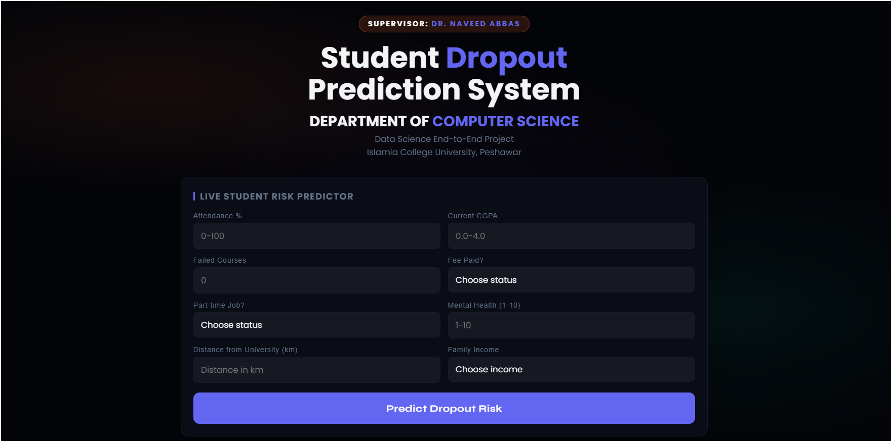
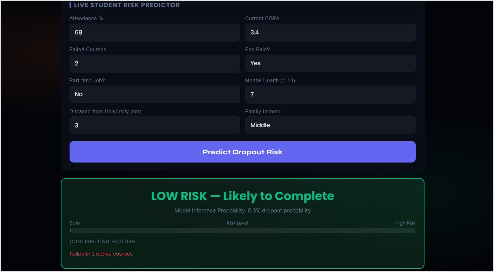
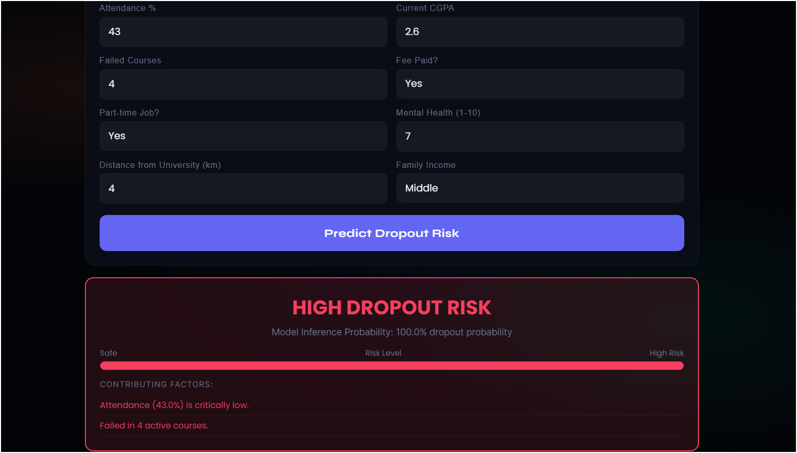
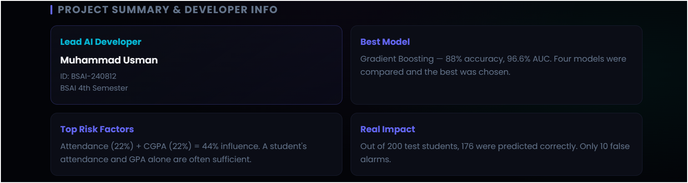

# Student Dropout Prediction System

<div align="center">

**An end-to-end machine learning system that identifies at-risk students before they drop out — built with a Gradient Boosting classifier, a FastAPI inference backend, and a real-time web interface.**


</div>

---

## Overview

Universities lose students every semester to dropout — and most of the time, the warning signs were already there in the data. This project turns those signals into action.

The system takes eight student attributes as input and returns a real-time dropout probability with a breakdown of the contributing risk factors. The entire pipeline — from raw CSV to a live prediction API — is contained in this repository.

This was built as a Data Science end-to-end semester project for the **Department of Computer Science, Islamia College University Peshawar**, under the supervision of **Dr. Naveed Abbas**.

---

## Screenshots

### Prediction Form


### Low Risk Result


### High Risk Result


### Project Summary Panel


---

## How It Works

A student's data is entered into the web form. The frontend sends a POST request to the FastAPI backend, which loads the pre-trained scikit-learn pipeline and returns a dropout probability in milliseconds. The UI renders the verdict, a risk bar, and a list of the specific factors that drove the prediction.

```
User fills form → JavaScript sends POST /api/predict-dropout
→ FastAPI validates input → Pipeline runs inference
→ JSON response → UI renders verdict + risk factors
```

No page reload. No waiting. The result appears instantly.

---

## Model Development

Four classifiers were trained and evaluated on the same dataset and pipeline:

| Model | Accuracy | AUC |
|---|---|---|
| Logistic Regression | 81.5% | 88.2% |
| Decision Tree | 83.0% | 85.4% |
| Random Forest | 86.5% | 94.1% |
| **Gradient Boosting** ✅ | **88.0%** | **96.6%** |

Gradient Boosting was selected as the final model. On 200 held-out test students, it correctly identified 176 — with only 10 false alarms.

### Feature Importance

The two most influential predictors are attendance and CGPA, together accounting for 44% of the model's decisions. This matches real-world intuition — a student who stops showing up and whose grades are falling is already partway out the door.

| Feature | Importance |
|---|---|
| Attendance % | 22% |
| Current CGPA | 22% |
| Failed Courses | 18% |
| Mental Health Score | 14% |
| Fee Status | 10% |
| Family Income | 7% |
| Part-time Job | 4% |
| Distance from Campus | 3% |

---

## Dataset

- **Records:** 1,000 students
- **Features:** 8 input features + 1 target label (`dropout`)
- **Class distribution:** 603 dropout cases, 397 non-dropout
- **Missing values:** 30 cells — handled by median imputation inside the sklearn Pipeline

| Feature | Type | Range |
|---|---|---|
| `attendance` | float | 0 – 100 (%) |
| `cgpa` | float | 0.0 – 4.0 |
| `failed_courses` | int | 0 – 10 |
| `fee_paid` | binary | 0 = No, 1 = Yes |
| `part_time_job` | binary | 0 = No, 1 = Yes |
| `mental_health` | int | 1 – 10 |
| `distance` | float | 0 – 200 (km) |
| `family_income` | int | 0 = Low, 1 = Middle, 2 = High |

---

## Tech Stack

| Layer | Technology |
|---|---|
| ML Pipeline | scikit-learn (Imputer → Scaler → GradientBoostingClassifier) |
| API Backend | FastAPI + Uvicorn |
| Data Validation | Pydantic v2 |
| Frontend | Vanilla HTML / CSS / JavaScript |
| Model Serialization | Python pickle |

---

## Project Structure

```
student-dropout-prediction/
│
├── model/
│   ├── students_data.csv         ← Training dataset
│   └── dropout_pipeline.pkl      ← Serialized sklearn pipeline
│
├── static/
│   └── index.html                ← Frontend web interface
│
├── assets/                       ← Screenshots for README
│
├── app.py                        ← FastAPI application
├── train.py                      ← Model training script
├── requirements.txt              ← Python dependencies
└── README.md
```

---

## Getting Started

### 1. Clone the repository

```bash
git clone https://github.com/MuhammadUsman0005/student-dropout-prediction.git
cd student-dropout-prediction
```

### 2. Install dependencies

```bash
pip install -r requirements.txt
```

### 3. Train the model

Place `students_data.csv` inside a `model/` folder, then run:

```bash
python train.py
```

This generates `model/dropout_pipeline.pkl`.

### 4. Start the API server

```bash
uvicorn app:app --reload --port 8000
```

### 5. Open the interface

Navigate to `http://localhost:8000` in your browser. The form is ready to use.

---

## API Reference

### `POST /api/predict-dropout`

**Request body:**
```json
{
  "attendance": 68.0,
  "cgpa": 3.4,
  "failed_courses": 2,
  "fee_paid": 1,
  "part_time_job": 0,
  "mental_health": 7,
  "distance": 3.0,
  "family_income": 1
}
```

**Response:**
```json
{
  "status": "success",
  "dropout_probability": 0.3,
  "verdict": "LOW RISK — Likely to Complete",
  "factors": [
    {
      "text": "Failed in 2 active courses.",
      "level": "warn"
    }
  ]
}
```

---

## Developer

**Muhammad Usman**
BSAI-240812 · BS Artificial Intelligence, 4th Semester
Islamia College University, Peshawar

[](https://github.com/MuhammadUsman0005)
[](https://linkedin.com/in/muhammad-usman-256364398)

**Supervisor:** Dr. Naveed Abbas

---

## License

MIT License — free to use and build on with attribution.
